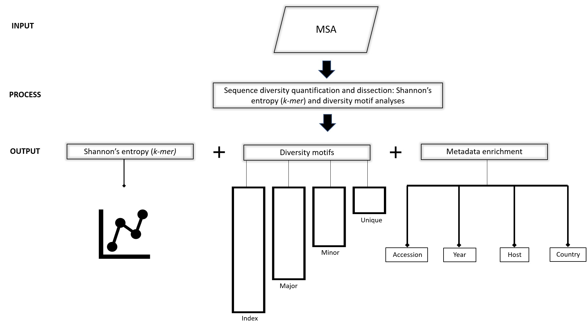

(Figure-2)=


: **Figure 2. Workflow schema.** ***Input:*** Viral protein sequences, typically obtained from publicly available databases (NCBI virus and GISAID, among others), aligned and submitted to DiMA in aligned FASTA (*.afa)* format. ***Process:*** DiMA provides a quantitative measure of sequence diversity by use of Shannon’s entropy, applied via a user-defined *k-mer* sliding window. Further, the entropy value is corrected for sample size bias by applying a statistical adjustment (Lipinski’s rule). Additionally, DiMA further interrogates the diversity by dissecting the entropy value at each *k-mer* position to various distinct *k-mer* sequences that are classified into diversity motifs (index, major, minor and unique; see Section 3 for the definition of the diversity motifs) based on their incidence. ***Output:*** The entropy values, diversity motifs, and each of the *k-mer* corresponding metadata is plotted to provide a panoramic overview of the protein sequence diversity. 

# 2.1. Entropy algorithm 
(Figure-3)=
```{image} images/entropy_algorithm.png
:alt: entropy_calculation
:class: bg-primary
:height: 1600px
:width: 1000px
:align: center
```

<a></a> 
: **Figure 3. Entropy algorithm.** 


# 2.2. Performance testing of DiMA

DiMA has been extensively tested with 18 protein datasets from six viral species. External validation of our tool has been performed by three individuals, with a total of 36 protein datasets, originating from three viral species.

# 2.3. Performance testing of Sample size bias correction

As it was explained in [Figure 3](Figure-3), entropy is corrected for sample size bias. Uncorrected (baseline) and corrected entropy values were calculated over a wide range of sample sizes (100 to 100,000)subsetted from SARS-CoV-2 Spike protein alignment. Then, protein-wide average entropy were plotted for each dataset. 

```{image} images/experiment_entropy_debiasing.png
:alt: mean_deviation
:class: bg-primary
:height: 500px
:align: center
```

**Conclusion:**

- The baseline entropy value appears to be generally an under-estimate relative to the corrected entropy, which can be a reflection of better data distribution achieved through the resampling approach for the corrected entropy.