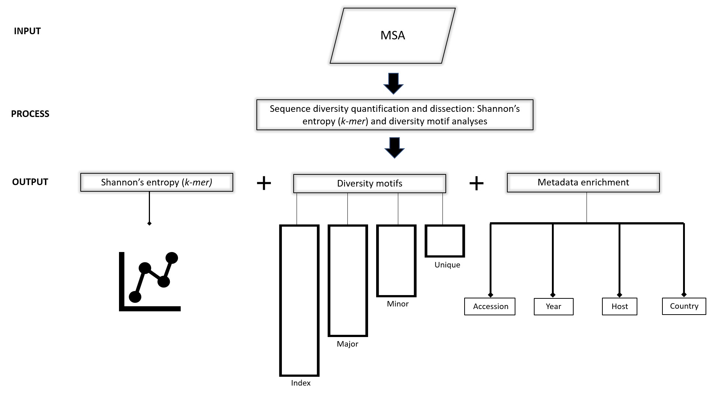

(Figure-2)=


: **Figure 2. Workflow schema.** ***Input:*** Viral protein sequences, typically obtained from publicly available databases (NCBI virus and GISAID, among others), aligned and submitted to DiMA in aligned FASTA (*.afa)* format. ***Process:*** DiMA provides a quantitative measure of sequence diversity by use of Shannon’s entropy, applied via a user-defined *k-mer* sliding window. Further, the entropy value is corrected for sample size bias by applying a statistical adjustment (Lipinski’s rule). Additionally, DiMA further interrogates the diversity by dissecting the entropy value at each *k-mer* position to various distinct *k-mer* sequences that are classified into diversity motifs (index, major, minor and unique; see Section 3 for the definition of the diversity motifs) based on their incidence. ***Output:*** The entropy values, diversity motifs, and each of the *k-mer* corresponding metadata is plotted to provide a panoramic overview of the protein sequence diversity. 

# 2.1. Entropy algorithm 
(Figure-3)=
```{image} images/entropy_algorithm.svg
:alt: entropy_calculation
:class: bg-primary
:height: 1600px
:width: 1000px
:align: center
```

<a></a> 
: **Figure 3. Entropy algorithm.** 


# 2.2. Performance testing of DiMA

DiMA has been extensively tested with 18 protein datasets from six viral species. External validation of our tool has been performed by three individuals, with a total of 36 protein datasets, originating from three viral species.

# 2.3. Performance testing of Sample size bias correction

As it has explained in [Figure 3](Figure-3), entropy is corrected for sample size bias. Two experiments using DNA polymerase (Pol) protein of Human immunodeficiency virus type 1 (HIV-1) group M, with curated alignment, downloaded from the [Los Alamos HIV sequence database](https://www.hiv.lanl.gov/content/sequence/NEWALIGN/align.html) were designed to test this methodology. In both of them, baseline (uncorrected) entropy values were compared with sample size bias corrected entropy values. The difference (deviation) of these values were evaluated over 100 iteration. Experiment details and conclusions are listed below. 

1- Mean entropy value of overall positions

```{image} images/allpositions_entropy_deviation_100run.svg
:alt: mean_deviation
:class: bg-primary
:height: 500px
:align: center
```

**Conclusions:**

1. There is very little variation between the corrected entropy values upon multiple repeats - a range of 0.007 was observed
2. If we take the average of all the corrected entropy values for the same position (repeated 100 times), and compare that with the average of the baseline of the same number of repeats, then the difference is approximately 0.01.

2- 4 positions from different conservation levels (Index incidence of 1, 15, 50, 98)

```{image} images/clevel_entropy_deviation_100run.svg
:alt: clevel_deviation
:class: bg-primary
:height: 500px
:align: center
```

**Conclusions:** 

1. The difference between the baseline and corrected entropy is affected by the inherent diversity of the sequences. The higher the diversity, the higher the difference between the two entropy values, with as high as approximately a difference of 2 entropy units for extremely diverse dataset.
2. The baseline entropy value appears to be generally an over-estimate relative to the corrected entropy, which can be a reflection of better data distribution achieved through the resampling approach of the corrected entropy.
