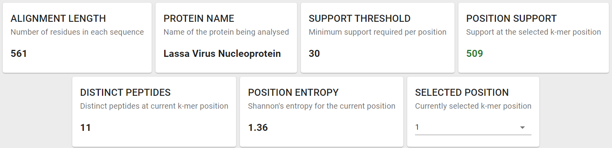
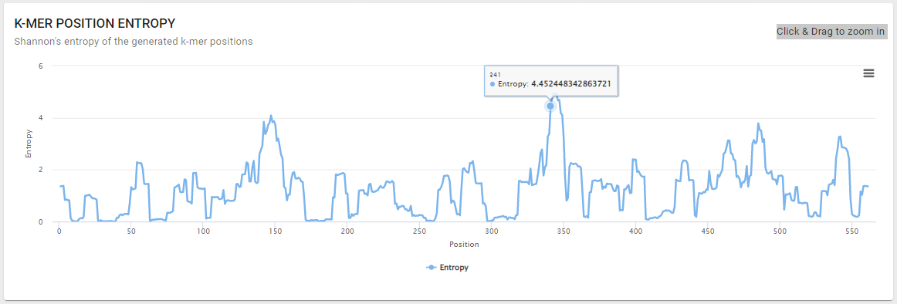
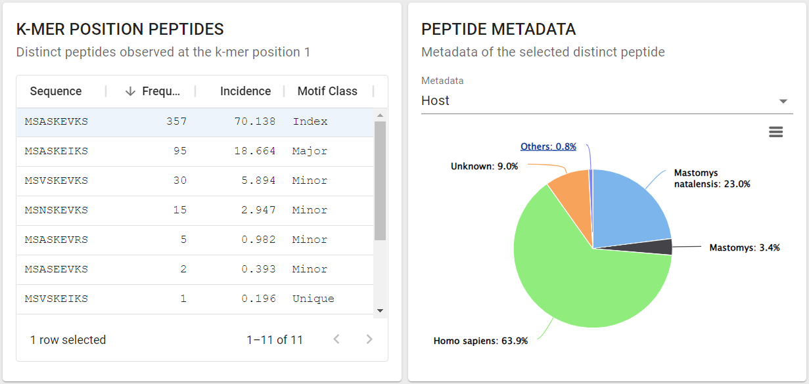

- **DiMA Output**

```{image} images/result_example.png
:alt: result
:class: bg-primary
:align: center
:width: 900px
```
<a></a> 
: **Figure 4. Sample output from DiMA analysis.** Bla bla bla
```{note}
Sample results are accesible for a self-exploration: 
- [MERS virus Spike protein nucleic acid sequences](https://dima.bezmialem.edu.tr/results/97a93eb4-6add-4824-b88d-02ff79af6acf), MERS virus Spike protein amino acid sequences 
- Lassa virus Nucleoprotein nucleic acid sequences, Lassa virus amino acid sequences 

```

- **Section 1 (Summary statistics)**

A summary of information about the query: request ID, submission parameters, the total number of sequences in the alignment, and the number of low support positions. 



- **Section 2 (Proteome diversity)**

Entropy values indicate the level of variability at the corresponding *k-mer* positions, with zero representing completely conserved positions. Plots provide a holistic view of the diversity and are responsive and interactive (one can easily hover and see the approximate entropy value of the hovered position). 


```{note}
For a benchmark, the peak absolute entropy of 9.2 and total variants of 98% were observed for HIV-1 clade B [(Hu et al., 2013)](https://journals.plos.org/plosone/article?id=10.1371/journal.pone.0059994). 
```

The methodology for calculation of Shannon’s entropy at each *k-mer* position is as per [Khan et al., (2008)](https://journals.plos.org/plosntds/article?id=10.1371/journal.pntd.0000272).

- **Section 3 (Diversity motifs)**

All sequences at each of the *k-mer* positions in the protein alignments were quantified and quantified for distinct sequences and ranked-classified into diversity motifs based on their incidences, as explained above under the [About](about.md) section.

Users can select a position from the “SELECTED POSITION” box, in the upper right corner to browse the motif distribution of the position.


```{image} images/section3.png
:alt: section3
:class: bg-primary
:width: 400px
:align: center
```
<br><br/>
- **Section 4 (Metadata)**

If the header format is provided in the analysis parameters (as described in the above [Parameters](parameters.md), DiMA will make a pie chart for each type of the metadata.  

The user should select a specific *k-mer* from the selected position for the metadata to appear. By default, the first peptide will be selected. In the example below, the index sequence is selected and host species distribution is shown in the plot.



- **Download**

Users can download the raw results file in JSON format from the most right bottom icon. 